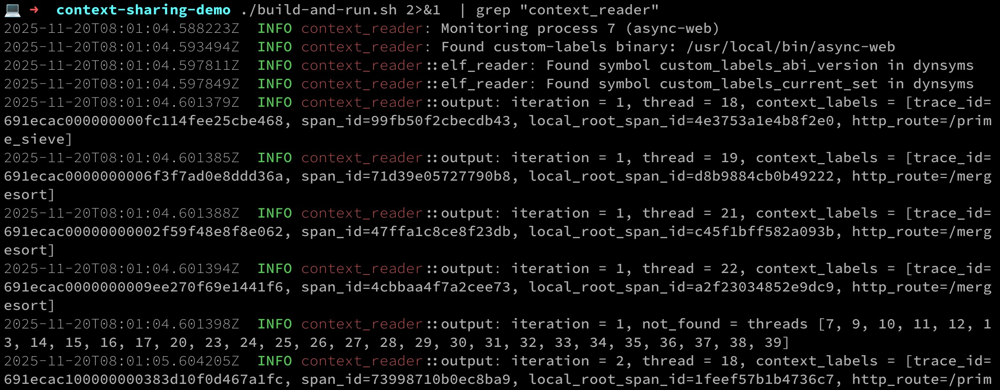

# Context Sharing Demo

This is a project that shows thread-local context stored by a Rust webserver using extensions to `dd-trace-rs` and `opentelemetry-rust`, and read out from out of process following
the [polarsignals custom labels TL storage format](https://github.com/polarsignals/custom-labels/tree/master). It's
made up of the following bits:

### A Demo App

* [opentelemetry-rust context-observer-test fork](https://github.com/bantonsson/opentelemetry-rust/tree/ban/context-observer-test) - Björn's context observer branch gives us the basic hook we need to capture what's happening in OTel. We will have to work to get this upstreamed before we can update dd-trace-rs.
* [dd-trace-rs context-observer-test fork](https://github.com/scottgerring/dd-trace-rs/tree/scottgerring/context-observer-test) - add an implementation of the context observer that can write to either the polarsignal's label storage (and thus process TL), _or_, to stdout. This is relatively _hackety hack_, but I am happy to clean it up into a serious contribution if it is helpful when we get there!
* [async-web](async-web) - This is the Rust app - both a HTTP API, and a background thread pool that pushes traffic through it to generate Interesting Data. It is instrumented with [dd-trace-rs] with the context observation turned on, and some magical build args sprinkled in to ensure that the TL symbols are published in the resulting binary despite its static linking.


### A Reader
* [context-reader](context-reader) - An out of process reader that, given a PID, periodically polls for TL labels and dumps them out to stdout. This is parsing the ELF _statically_ to find the symbols, but shouldn't be too difficult to modify to do it out of process memory. It uses `ptrace` to periodically stop the process and read out the TLs.
* [Dockerfile](dockerfile) and [build-and-run.sh](build-and-run.sh) - An easy way to plug this all together and see if it works in a Linux container (which is rather useful if you happen to be developing on a Mac)

When you fire it up with, you will see the propagation of TL context from the sample workload into the reader:



## How to use this?
To make my life easier, the demo app takes a local path dependency on `dd-trace-rs`. You'll need to [clone the relevant branch](https://github.com/scottgerring/dd-trace-rs/tree/scottgerring/context-observer-test)  into this directory for this to work. I will clean this up when other people care!

# Observations
* This all depends on getting the context observer into otel-rust, which _should_ be relatively uncontroversial, but may not be.
* The memory format itself uses a root 'label set' with keys/values referenced out by pointer; this means we need to do a bunch of individual reads into the process while it is being suspended to extract state. Could we not do this in one contiguous chunk by constraining the maximum size of the record? 
* [RustXP]
  * The combination of native and rust code in the library adds extra build deps that rust-only wouldn't have. It looks like [the rust compiler provides no way to customize TLS dialect](https://github.com/rust-lang/rust/pull/132480) (and the other flags below in this README to llvm only affect linking, which don't help here); ARM64 defaults to TLSDESC, but x86-64 uses "traditional" TLS.
  * The `build.rs` customization required in the user's executable is not great UX for a rust app:
  * Extra `build-dependency` from the user's app on the polarsignals lib 
  * Custom `build.rs` to invoke the polarsignals customization pieces
  
## Open Questions

* Is `local root span ID` something that only _Datadog_ is going to need as part of this, or _everyone_? This goes to whether or not this should be a sort of first-class feature in the context observation mechanism, or not
* What about the set of additional request metadata to capture - is this likely to be a static, globally-agreed set, or is it going to be have to be user configurable? E.g. does dd-trace-rs need to be able to ask otel-rust for a set of metadata that otel-rust does not in advance know of.
* Do we want the _user_ to be able to explicitly request context data be made available on the context labels? 
* How terrible do we feel about reading span data before it is finalized? Trace & Span IDs should be fine and immutable, other span attributes are not per the OTel spec. Björn observes that that _in practice_ these should be immutable, as things like sampling will not work properly if they are mutated after the span is created. 
* Does it make sense to have a sense of attachable label sets (as polarsignals call them) indirected through a pointer? This would make it possible to serialize the context for a given user request once, and simply point at it again when it is re-attached to a thread. 

## Scott Scratch
This is really just notes for me!

### Discoverability
`.symtab` vs `.dynsym`. The former is where debug symbols go, the latter is where we need them to be if we want them to be discoverable. It appears this is only achievable with linker flags like: `-Wl,--dynamic-list=./dlist`, where dlist lists the symbols from the custom-labels crate that we want to be discoverable.

An alternative is building the lib to a shared library, where `#[no_mangle]` will see the labels TL ending up predictably in the `dynsym`. But this makes runtime fun, and the community typically expects statically linked bins.

An alternative way of doing the "export this single" thing in Rust involves editing `.cargo/config.toml` - this feels like the sweet spot - something like this:

```
 # .cargo/config.toml

  [target.'cfg(target_os = "linux")']
  rustflags = [
      "-Clink-arg=-Wl,--export-dynamic-symbol=custom_labels_abi_version",
      "-Clink-arg=-Wl,--export-dynamic-symbol=custom_labels_current_set",
  ]
```

### Alternative TL Discovery Ideas

Do the 'fake system call' thing that the security folks are doing, where an eBPF probe is attached to the system call interface, and userspace passes in a TL offset through an otherwise undefined system call.

Use [shm](https://www.man7.org/linux/man-pages/man7/shm_overview.7.html) to publish info about the TL locations. I could imagine this is a nightmare when cgroup namespacing is involved, but i've not looked into it. Upside is we'd have the whole address space for ourselves, and wouldn't need to rely on the discoverabilty of the symbols in the main binary.

Mutate process environment variables at startup to share TL offsets such that they can be accessed from `/proc/123/environ`. This feels gross, but on the other hand, reading process env vars is a fairly known quantity. Would have to confirm that
mutations after process start are reflected in the `environ` proc file.

### Alternative in-memory structure

Goal: single read call to entire region rather than pointer chasing, fixed size structure to avoid heap alloc. This is something you chould probably do very sensibly with protobuf / msgpack.

This is rust by way of example, but probably msgpack or protobuff would be a sensible x-lang choice.

```
 /// A single label entry with inline storage (no pointers)
  #[repr(C)]
  #[derive(Debug, Clone, Copy)]
  pub struct FlatLabel {
      /// Length of the key in bytes (0 means unused slot)
      /// Key is always a string.
      pub key_len: u8,

      /// Type of the value
      pub value_type: LabelValueType,

      /// Length of the value in bytes
      pub value_len: u16,

      /// Inline key storage 
      pub key_data: [u8; MAX_KEY_LENGTH],

      /// Inline value storage 
      pub value_data: [u8; MAX_VALUE_LENGTH],
  }

  /// The root structure stored behind the TLS
  #[repr(C)]
  #[derive(Debug, Clone, Copy)]
  pub struct FlatLabelSet {
      /// Whether this label set is currently attached and valid
      /// We flip this on _after_ we've completed writing the label structure, after a context is attached
      /// We flip this off _before_ we start updating the label structure, after a context is attached
      /// We flip this off when a context is dettached
      ///
      /// If rather than doing this we have a pointer in the TL to the 'active label set', this would
      /// let us re-use the serialized structure when a span is re-attached to a thread and is
      /// probably more sensible!
      pub is_attached: bool,

      /// We're into usize (8 bytes) straight after this, so we're probably going to get padded to an 8 byte
      /// boundary here by the compiler. May as well make it explicit.
      _padding: [u8; 7],

      /// Maximum size of this entire structure in bytes
      /// The first time we read, we can note this down, and use it to do a single read of the entire struct every
      /// time subsequently.
      pub maximum_size: usize,

      /// Number of labels currently in use
      pub count: usize,

      /// Inline array of labels
      pub labels: [FlatLabel; MAX_LABELS],
  }
```
